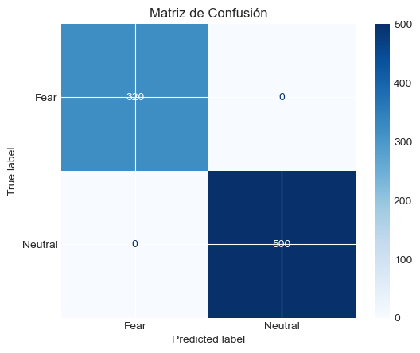
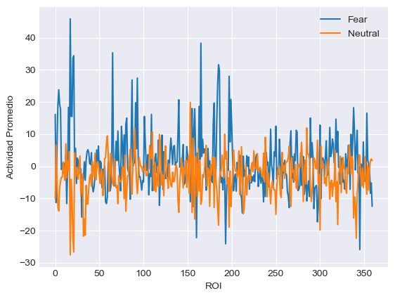
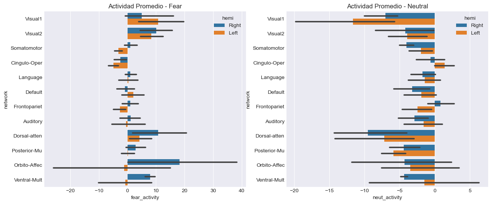
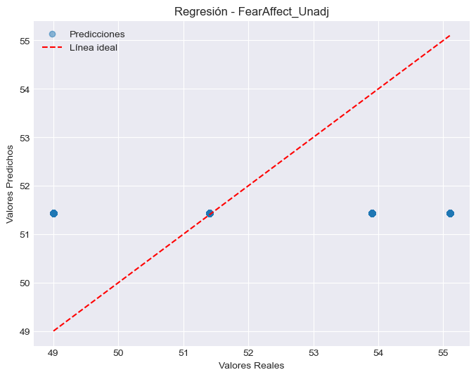
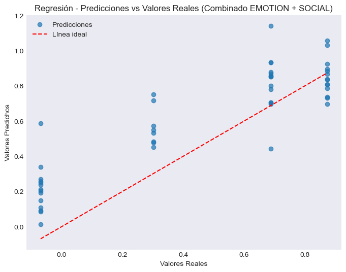

# NeuroResponseNet (HCP fMRI) 🧠⚡

[](https://github.com/<your-username>/<your-repo>/actions/workflows/ci.yml)
[](LICENSE)


A compact, reproducible research repo that explores **brain-response prediction** from **HCP fMRI ROI time series**.

This project trains neural models (e.g., **LSTM** / liquid-like RNN variants) to:
- **Classify** task condition signals (e.g., **EMOTION: Fear vs Neutral**) from ROI activity
- **Regress** behavioral/affect measures (e.g., `FearAffect_Unadj`)
- **Interpret** results via ROI/network-level summaries (hemisphere + functional networks)

> If your brain had a log file, this repo is a first pass at parsing it. (Respectfully. With science.)

---

## Highlights

### EMOTION classification (Fear vs Neutral)
- **ROC AUC:** **1.00** (on the split used in the notebook)
- **Confusion matrix:** perfect separation in that evaluation

<p align="center">
  
  
</p>

### Brain activity summaries (ROI + networks)
<p align="center">
  
  
</p>

### Regression examples
<p align="center">
  
  
</p>

---

## Repository structure

```
.
├─ notebooks/
│  └─ Proyecto_HCP_IB.ipynb
├─ assets/                # Figures used in this README
├─ src/                   # (Optional) place for refactoring notebook code into modules
├─ scripts/               # Utility scripts
└─ docs/                  # Optional GitHub Pages content
```

---

## Quickstart

### 1) Create an environment
This notebook-oriented repo assumes a typical scientific Python stack.

```bash
python -m venv .venv
# Windows: .venv\Scripts\activate
# macOS/Linux: source .venv/bin/activate
pip install -r requirements.txt
```

### 2) Run
Open and run the notebook:

```bash
jupyter lab
# then open notebooks/Proyecto_HCP_IB.ipynb
```

---

## Data

This repo **does not include the HCP dataset**.

- Use your own HCP access / local copy (per the dataset’s terms).
- Keep raw data out of GitHub (large + licensing).

---

## Reproducibility notes

The metrics shown here (e.g., AUC=1.00) are **from the notebook’s evaluation split**.
For a research-grade benchmark, consider:
- subject-level splits (avoid leakage)
- cross-validation
- reporting confidence intervals

---

## Ethics & Disclaimer

Research/education only.
Not medical advice and not a diagnostic tool.

---

## Authors

- Iván Vázquez
- Juan Daniel Rosales

---

## Citation

If you build on this work, please cite the repo (see `CITATION.cff`).
